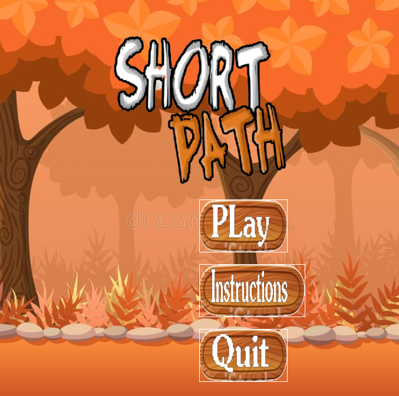
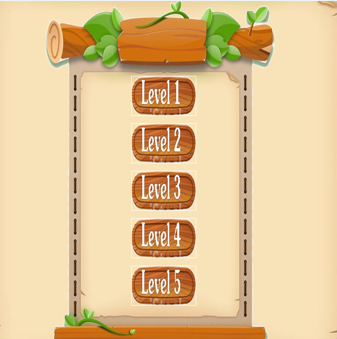
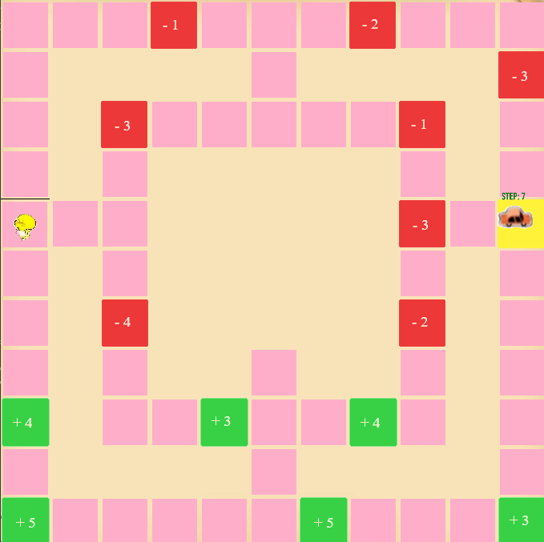

#### Table of contents
1. [Introduction](#introduction)
2. [Features](#features)
3. [How to Play](#play)
4. [Game Overview](#view)
5. [Install](#installation)

# Introduction 

* Game is inspired by algorithms : Dijkstra [ SHORTEST PATH ]
* Short path created with [SDL2](https://www.libsdl.org/download-2.0.php) and C++.

_*Resources used in the game are collected from the Internet and most have been edited to suit the nature of the game.

# Features 

**first. GameWindow**
* Handle collisions between characters and tile map tiles.
* Handles the player's key/mouse operation.
* Show the character's hp status.

**2. TabWin**
* Display function buttons : forward to next level , exit , and function button to go back to select level .

**3. TabGameOver**
* Display function buttons: replay , exit , and function buttons to go back to select level .

# How to play 
* Use the up , down , left , right keys to control the character to move along the shortest path to the goal , so that the number of hp >= 0 .
* When moving the character over a new tile, the hp automatically deducts the corresponding amount of that tile.
* Click on the function buttons to use .

# Game Overview 

# Install 

After installing [Mingw64](https://sourceforge.net/projects/mingw-w64/files/Toolchains%20targetting%20Win64/Personal%20Builds/mingw-builds/8.1.0/threads-win32/seh/x86_64- 8.1. 0-release-win32-seh-rt_v6-rev0.7z/download), [SDL2](https://www.libsdl.org/download-2.0.php), [SDL_Image](https://www. libsdl.org/projects/SDL_image), [SDL_TTF](https://www.libsdl.org/projects/SDL_ttf), and [SDL_Mixer](https://www.libsdl.org/projects/SDL_mixer), run * *Shot path.exe** to enter the game.

_* You may not need to install SDL2, SDL_Image, SDL_TTF and SDL_Mixer because the **.dll** files are already there.